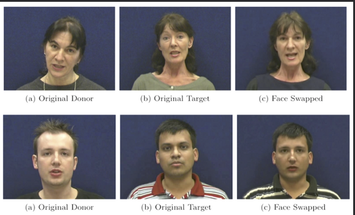
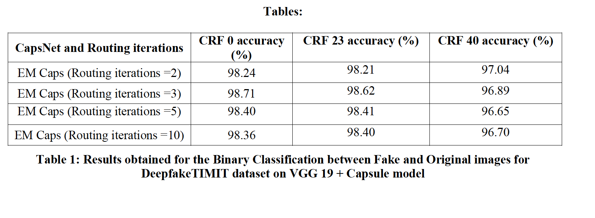
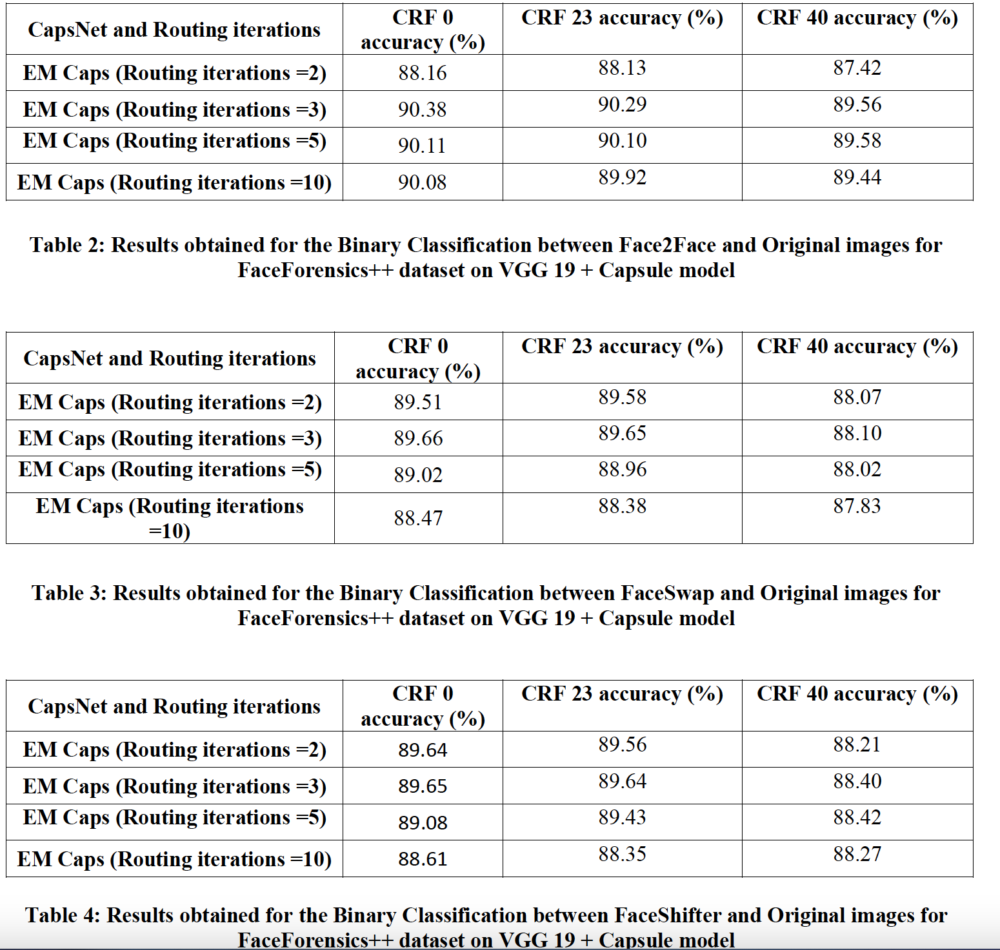
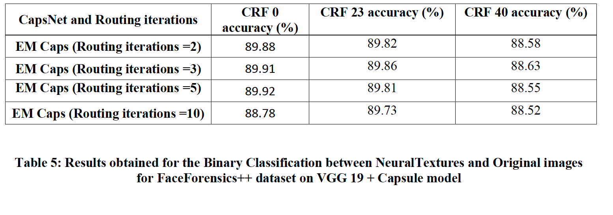
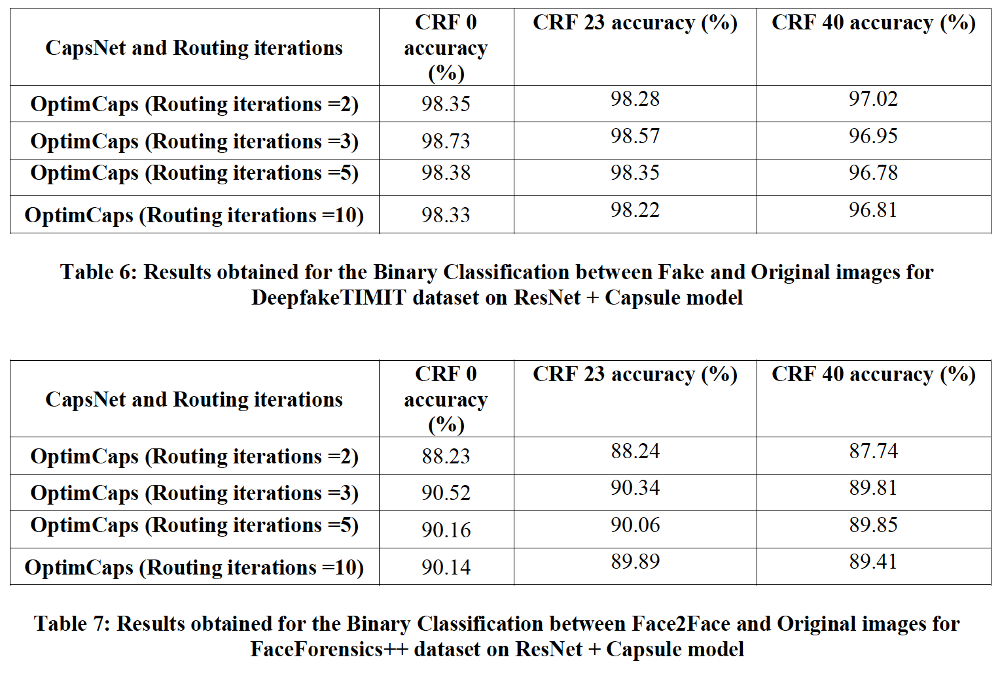

# Deepfake Detection Using Improved Routing Algorithms in Capsule Networks


## Overview
This project focuses on enhancing deepfake detection using capsule networks. By implementing improved dynamic routing algorithms, the system effectively differentiates between real and AI-generated images, contributing significantly to digital media authenticity and security.

## Data Structure
```
data
└── deepfaketimit
├── train
├── test
└── val
```

## Code
Python files for each implemented model (e.g., OptimCaps, GroupCaps, AttnCaps, EMCaps) are directly available in the repository.

## Detailed Understanding
For an in-depth understanding of methodologies and results, please refer to the project report and presentation included in the repository.

## Results Overview
The project successfully showcases the effectiveness of different routing algorithms in capsule networks for deepfake detection. Future work includes converting this into a user interface-based detection engine.






